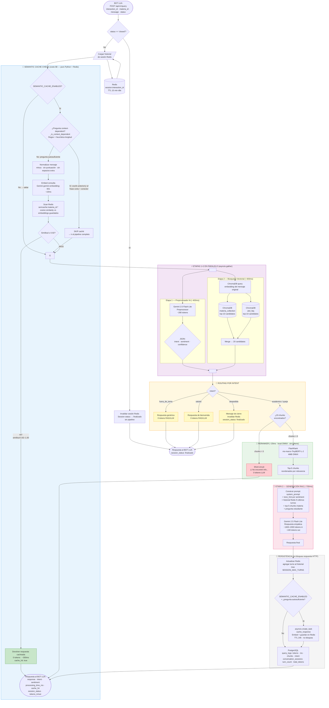

# BotAcademia Engine ??  v0.2.0

**Motor de Tutor�a IA basado en RAG** para la plataforma UTEL.  
Procesa consultas acad�micas desde WhatsApp/BOT LUA usando Gemini 2.5 Flash Lite + ChromaDB + Redis + Kafka.

---

## Arquitectura

```
BOT LUA  --POST /api/v1/query--?  FastAPI (Orquestador)
                                        �
                          +-------------+----------------------+
                          ?             ?                        ?
                    Gemini LLM     ChromaDB               PostgreSQL
                  (Pre-process   (Vector Search            (QueryLog +
                   + Response)    materia + FAQ)         ConversationSession)
                          �
                   +------�  SIEMPRE ACTIVO
                   +-- Redis   (Historial de sesi�n por interaction_id, TTL 1h)
                          �
                   +------�  PRODUCCI�N (USE_KAFKA=true)
                   �  Kafka Topics:
                   �    botacademia.incoming_messages  --? Worker 1 (Preprocessor)
                   �    botacademia.processed_queries  --? Worker 2 (RAG + LLM)
```

### Pipeline de cada consulta

```
1. raw_message --?  Pre-procesador IA (Gemini)
                     ? intent: academico | saludo | queja | fuera_de_tema | despedida
                     ? sentiment: estresado | molesto | neutral | positivo
                     ? clean_query: pregunta optimizada para b�squeda sem�ntica

2. Redis         --? Cargar historial de sesi�n (�ltimos SESSION_MAX_TURNS turnos)

3. [parallel]
   clean_query  --? ChromaDB materia (top 10 candidatos acad�micos)
   clean_query  --? ChromaDB utel_faq (top 10 candidatos FAQ)
                     ? merge ? 20 candidatos ? FlashRank reranker ? top 5

4. top-5 chunks + historial + query --? Gemini (Generaci�n RAG)
                                          ? Respuesta emp�tica, basada en contexto

5. response  --? Redis (guardar turno en sesi�n)
             --? PostgreSQL (QueryLog + ConversationSession)
             --? BOT LUA

6. intent='despedida' --? limpiar Redis + session_status='finalizado'
   status='closed'    --? limpiar Redis + session_status='finalizado' (sin pipeline)
```

---

## Base de Conocimiento � Estrategia de Vectorizaci�n (v0.2)

### Problema resuelto
Las 418 preguntas y respuestas del FAQ de UTEL estaban duplicadas en cada materia (�5),
los chunks de tama�o fijo part�an respuestas a mitad de un paso, y el embedding de texto completo
(Q+A) dilu�a la precisi�n de recuperaci�n.

### Soluci�n implementada

| Aspecto | Antes (v0.1) | Ahora (v0.2) |
|---|---|---|
| FAQ storage | Duplicado en cada materia � 5 = 2090 chunks | Colecci�n �nica `utel_faq` = 418 chunks |
| Chunking | Fijo 1000 chars (part�a respuestas a mitad) | At�mico: 1 par Q+A = 1 chunk |
| Embedding | Texto completo Q+A (diluci�n sem�ntica) | Solo texto `Q:` (indexado) + `full_qa` en metadata |
| B�squeda | Solo colecci�n de materia | `semantic_search_combined()` � materia + FAQ en paralelo |
| Reranker query | `clean_query` expandida con nombre de materia | `message` original del usuario (sin sesgo l�xico) |

### Colecciones ChromaDB

```
materia_utel_faq:                               418 Q&A chunks   ? FAQ compartido
materia_258_criminologia_b:                     952 chunks acad�micos
materia_156_sociologia_rural_c:               1 222 chunks acad�micos
materia_58_estadistica_y_probabilidad:        2 231 chunks acad�micos
materia_152_introduccion_admin_publica_c:     3 288 chunks acad�micos
materia_155_principios_perspectivas_admin_c:  3 307 chunks acad�micos
```

---

## Gesti�n de Sesiones

Cada `interaction_id` representa una conversaci�n.  
El historial se mantiene en Redis durante la conversaci�n y se elimina al finalizar.

### Estados de sesi�n

| Estado | C�mo se alcanza | Efecto |
|---|---|---|
| `active` | Cualquier query normal | Pipeline completo, historial actualizado en Redis |
| `finalizado` | LLM detecta intent `despedida` | Redis limpiado, `session_status: "finalizado"` en respuesta |
| `closed` | Sistema externo env�a `status: "closed"` | Redis limpiado sin llamar al pipeline |

### Tabla `conversation_sessions` (PostgreSQL)

```
interaction_id  materia_id   turn_count  status      started_at   closed_at
--------------  -----------  ----------  ----------  -----------  ----------
lua_abc123      258_Crim�    4           active      2026-03-04   null
lua_xyz456      58_Esta�     2           finalizado  2026-03-04   2026-03-04
```

---

## Estructura del Proyecto

```
botAcademIA/
+-- app/
�   +-- main.py
�   +-- api/v1/routes/
�   �   +-- messages.py          # POST /query (con gesti�n de sesi�n completa)
�   �   +-- ingest.py            # POST /ingest, GET /ingest/list
�   +-- core/
�   �   +-- config.py            # Settings (USE_REDIS=true, SESSION_MAX_TURNS=10)
�   �   +-- database.py          # Async PostgreSQL + migraciones idempotentes
�   �   +-- logging.py
�   +-- models/
�   �   +-- schemas.py           # QueryRequest (status) + QueryResponse (session_status)
�   �   +-- db_models.py         # QueryLog + ConversationSession + MateriaIndex
�   +-- services/
�   �   +-- pipeline.py          # Orquestador: sesi�n Redis + RAG + farewell detection
�   �   +-- llm_service.py       # Gemini: intent despedida + historial en prompt
�   �   +-- vector_store.py      # ChromaDB + semantic_search_combined()
�   �   +-- ingest_service.py    # Chunking Q&A-aware + FAQ extractor
�   �   +-- reranker.py          # FlashRank ms-marco-TinyBERT (~18ms)
�   �   +-- redis_cache.py       # get/update/invalidate_session
�   +-- workers/
�       +-- kafka_producer.py
�       +-- kafka_consumer.py    # Worker2: historial Redis + session update
+-- data/materias/               # 5 materias POC
+-- scripts/
�   +-- reingest_smart.py        # Ejecutar tras cambios en la KB
+-- docker-compose.yml           # FastAPI + ChromaDB + PostgreSQL + Redis (siempre)
�                                # + Kafka/Zookeeper/KafkaUI (perfil production)
+-- Dockerfile
+-- requirements.txt
```

---

## Setup R�pido

### 1. Configurar variables de entorno

```bash
cp .env.example .env
# Agregar GEMINI_API_KEY
```

### 2. Levantar servicios (Redis incluido por defecto desde v0.2)

```bash
docker compose up -d

# Verificar que los 4 servicios est�n healthy
docker compose ps
```

### 3. Vectorizar la base de conocimiento (primera vez)

```bash
docker cp scripts/reingest_smart.py botacademia_api:/app/reingest_smart.py
docker exec botacademia_api python /app/reingest_smart.py
```

### 4. Con perfil de producci�n (Kafka + alto volumen)

```bash
docker compose --profile production up -d

# En .env:
USE_KAFKA=true
```

---

## API Reference

| M�todo | Endpoint | Descripci�n |
|--------|----------|-------------|
| `POST` | `/api/v1/query` | Consulta acad�mica (con gesti�n de sesi�n) |
| `GET`  | `/api/v1/health` | Estado de todos los servicios |
| `POST` | `/api/v1/ingest` | Vectorizar una materia |
| `GET`  | `/api/v1/ingest/list` | Listar materias disponibles |
| `GET`  | `/docs` | Swagger UI |

### Payload � query normal (`status: "active"`)

```json
{
  "interaction_id": "lua_conv_abc123",
  "materia_id": "258_Criminologia_B",
  "message": "no entiendo la diferencia entre crimen y delito",
  "status": "active"
}
```

### Respuesta � conversaci�n activa

```json
{
  "interaction_id": "lua_conv_abc123",
  "materia_id": "258_Criminologia_B",
  "response": "�Claro! En criminolog�a...",
  "intent": "academico",
  "sentiment": "neutral",
  "processing_time_ms": 2340.5,
  "status": "completed",
  "session_status": "active"
}
```

### Respuesta � sesi�n finalizada

```json
{
  "interaction_id": "lua_conv_abc123",
  "materia_id": "258_Criminologia_B",
  "response": "�Fue un placer acompa�arte! ?? �Mucho �xito en tus estudios! ??",
  "intent": "despedida",
  "sentiment": "neutral",
  "processing_time_ms": 580.0,
  "status": "completed",
  "session_status": "finalizado"
}
```

### Payload � cierre desde sistema externo (`status: "closed"`)

```json
{
  "interaction_id": "lua_conv_abc123",
  "materia_id": "258_Criminologia_B",
  "message": "",
  "status": "closed"
}
```

> El sistema externo detecta `session_status: "finalizado"` para saber que la conversaci�n
> termin� (ya sea por farewell del estudiante o por cierre expl�cito del sistema externo).

---

## Ciclo Completo de Conversaci�n � Ejemplo

```bash
# Turno 1
curl -X POST http://localhost:8080/api/v1/query \
  -H "Content-Type: application/json" \
  -d '{"interaction_id":"sess_001","materia_id":"58_Estadistica_y_probabilidad",
       "message":"cual es la probabilidad de que salga 1 cuando lanzo un dado?",
       "status":"active"}'
# ? session_status: "active"

# Turno 2 � el LLM tiene contexto del turno anterior
curl -X POST http://localhost:8080/api/v1/query \
  -H "Content-Type: application/json" \
  -d '{"interaction_id":"sess_001","materia_id":"58_Estadistica_y_probabilidad",
       "message":"y si lanzo dos dados, como calculo que ambos salgan 1?",
       "status":"active"}'
# ? session_status: "active"

# Turno 3 � despedida natural ? LLM detecta intent=despedida
curl -X POST http://localhost:8080/api/v1/query \
  -H "Content-Type: application/json" \
  -d '{"interaction_id":"sess_001","materia_id":"58_Estadistica_y_probabilidad",
       "message":"muchas gracias ya entendi todo hasta luego!",
       "status":"active"}'
# ? session_status: "finalizado"   (Redis limpiado, session.status=finalizado en PG)

# Alternativa � sistema externo cierra sin despedida
curl -X POST http://localhost:8080/api/v1/query \
  -H "Content-Type: application/json" \
  -d '{"interaction_id":"sess_001","materia_id":"58_Estadistica_y_probabilidad",
       "message":"","status":"closed"}'
# ? session_status: "finalizado"   (sin pipeline, Redis limpiado)
```

---

## Stack Tecnol�gico

| Componente | Tecnolog�a | Notas |
|------------|-----------|-------|
| API | FastAPI 0.115 | async, hot-reload en dev |
| LLM | Gemini 2.5 Flash Lite | sin thinking tokens, ~2s respuesta |
| Reranker | FlashRank TinyBERT-L-2 | ~18ms, 4MB ONNX, query=original |
| Base vectorial | ChromaDB 0.5.23 | 6 colecciones (5 materias + FAQ global) |
| Base relacional | PostgreSQL 16 | QueryLog + ConversationSession |
| Cach� de sesi�n | Redis 7 | TTL 1h, siempre activo desde v0.2 |
| Mensajer�a | Apache Kafka 7.6 (Confluent) | perfil `production` |
| Contenedores | Docker + Docker Compose | |
| Lenguaje | Python 3.11+ | |

---

## Comandos de Gesti�n

```bash
# Iniciar stack base (FastAPI + ChromaDB + PostgreSQL + Redis)
docker compose up -d

# Con Kafka para alto volumen
docker compose --profile production up -d

# Ver logs en tiempo real
docker compose logs -f botacademia_api

# Forzar recreaci�n (necesario tras cambios en .env)
docker compose up -d --force-recreate botacademia_api

docker compose logs -f botacademia_api 2>&1 | Select-String "WARNING|RAG EMPTY|RAG NO CHUNKS"

# Apagar
docker compose down          # sin borrar vol�menes
docker compose down -v       # borrar vol�menes (ChromaDB y PG reinician desde cero)
```

# limpiear cahce
docker exec botacademia_redis redis-cli KEYS "semcache:*" | Measure-Object -Line
---

## 12 Pruebas de Referencia

### 1 � Conversaci�n multi-turno

```bash
# Turno 1
curl -X POST http://localhost:8080/api/v1/query -H "Content-Type: application/json" \
  -d '{"interaction_id":"conv_001","materia_id":"258_Criminologia_B",
       "message":"que es la criminologia?","status":"active"}'

# Turno 2 (el LLM conoce la respuesta anterior)
curl -X POST http://localhost:8080/api/v1/query -H "Content-Type: application/json" \
  -d '{"interaction_id":"conv_001","materia_id":"258_Criminologia_B",
       "message":"y cuales son sus ramas principales?","status":"active"}'

# Turno 3 � despedida ? session_status: "finalizado"
curl -X POST http://localhost:8080/api/v1/query -H "Content-Type: application/json" \
  -d '{"interaction_id":"conv_001","materia_id":"258_Criminologia_B",
       "message":"gracias ya entendi todo","status":"active"}'
```

### 2 � Cierre desde sistema externo

```bash
curl -X POST http://localhost:8080/api/v1/query -H "Content-Type: application/json" \
  -d '{"interaction_id":"conv_001","materia_id":"258_Criminologia_B",
       "message":"","status":"closed"}'
```

### 3 � FAQ: inscribirse a cursos opcionales

```bash
curl -X POST http://localhost:8080/api/v1/query -H "Content-Type: application/json" \
  -d '{"interaction_id":"faq_001","materia_id":"258_Criminologia_B",
       "message":"como puedo inscribirme a los cursos opcionales?","status":"active"}'
```

### 4 � FAQ: mensajer�a al profesor

```bash
curl -X POST http://localhost:8080/api/v1/query -H "Content-Type: application/json" \
  -d '{"interaction_id":"faq_002","materia_id":"258_Criminologia_B",
       "message":"como puedo dejarle un mensaje a mi profesor?","status":"active"}'
```

### 5 � Contenido acad�mico: criminolog�a

```bash
curl -X POST http://localhost:8080/api/v1/query -H "Content-Type: application/json" \
  -d '{"interaction_id":"test_001","materia_id":"258_Criminologia_B",
       "message":"que es la criminologia y para que sirve?","status":"active"}'
```

### 6 � Estudiante estresado

```bash
curl -X POST http://localhost:8080/api/v1/query -H "Content-Type: application/json" \
  -d '{"interaction_id":"test_003","materia_id":"258_Criminologia_B",
       "message":"no entiendo NADA y el examen es manana, ayuda!!","status":"active"}'
```

### 7 � Saludo puro (sin RAG)

```bash
curl -X POST http://localhost:8080/api/v1/query -H "Content-Type: application/json" \
  -d '{"interaction_id":"test_004","materia_id":"258_Criminologia_B",
       "message":"hola buenas tardes como estas","status":"active"}'
```

### 8 � Fuera de tema

```bash
curl -X POST http://localhost:8080/api/v1/query -H "Content-Type: application/json" \
  -d '{"interaction_id":"test_005","materia_id":"258_Criminologia_B",
       "message":"cuanto cuesta un iphone?","status":"active"}'
```

### 9 � Estad�stica: dado

```bash
curl -X POST http://localhost:8080/api/v1/query -H "Content-Type: application/json" \
  -d '{"interaction_id":"test_dado","materia_id":"58_Estadistica_y_probabilidad",
       "message":"cual es la probabilidad de que salga 1 cuando lanzo un dado?","status":"active"}'
```

### 10 � Administraci�n P�blica

```bash
curl -X POST http://localhost:8080/api/v1/query -H "Content-Type: application/json" \
  -d '{"interaction_id":"test_009","materia_id":"152_Introduccion_a_la_administracion_publica_C",
       "message":"diferencia entre administracion publica y privada","status":"active"}'
```

### 11 � Verificar sesiones en PostgreSQL

```bash
docker exec botacademia_postgres psql -U botacademia -c \
  "SELECT interaction_id, turn_count, status, started_at, closed_at
   FROM conversation_sessions ORDER BY started_at DESC LIMIT 10;"
```

### 12 � Estado del sistema

```bash
curl http://localhost:8080/api/v1/health
```

---

## Ver Logs

```bash
# Tiempo real
docker compose exec botacademia_api tail -f /app/logs/app.log

# Filtrar por sesi�n
docker compose exec botacademia_api grep "conv_001" /app/logs/app.log

# Desde host (Windows)
Get-Content logs\app.log -Tail 50
```

Ejemplo de traza completa de una sesi�n:

```
Pipeline start       | interaction=conv_001 materia=258_Criminologia_B
Session history loaded | interaction=conv_001 turns=2
Pre-process done     | intent=academico sentiment=neutral 490ms
QUERY ORIGINAL       | cuales son sus ramas principales?
RAG search done      | materia=258_Criminologia_B chunks=20 260ms
Reranker done        | 20→5 chunks 19ms | top score=0.997
Pipeline complete    | total=2150ms (parallel=490 rerank=19 llm=1400)
```

---

## Diagrama de Flujo Completo — BotAcademia Engine v0.3



---

### Descripción textual del flujo (para generación de imagen)

**Sistema:** BotAcademia Engine — Motor de Tutoría IA basado en RAG para UTEL.

**Componentes principales** (de izquierda a derecha, de arriba a abajo):
- **BOT LUA** → API FastAPI → Pipeline orquestador → respuesta de vuelta al BOT LUA
- **Redis** (izquierda): historial de sesión multi-turno + caché semántico de respuestas
- **ChromaDB** (centro): base vectorial con 6 colecciones (5 materias + FAQ global)
- **Gemini API** (centro-derecha): 2 llamadas — preprocesador (~280 tokens) y generación RAG (~1600 tokens)
- **FlashRank** (local, ONNX): reranker sin llamadas externas, ~20ms
- **PostgreSQL** (derecha): log permanente de cada consulta y métricas de sesión

**Flujo resumido en 8 pasos:**

```
[1] BOT LUA envía mensaje
        ↓
[2] CIERRE RÁPIDO: status=closed → limpiar Redis → responder sin pipeline
        ↓
[3] CACHÉ SEMÁNTICO:
    ¿Pregunta autosuficiente? (regex + heurística de longitud)
      → SÍ → Buscar en Redis por similitud coseno (embedding Gemini)
              ≥ 0.92 similitud → HIT → responder en 300ms, 0 tokens
              < 0.92           → MISS → continuar al pipeline
      → NO (referencia al contexto) → saltar caché
        ↓
[4] PARALELO (asyncio.gather):
    ├── Preprocesador Gemini → intent + sentiment + confidence
    └── ChromaDB → top-10 materia + top-10 FAQ → merge 20 candidatos
        ↓
[5] ROUTING por intent:
    fuera_de_tema / saludo / despedida → respuesta hardcoded, fin
    academico / queja → continuar
        ↓
[6] RERANKER FlashRank (local):
    20 candidatos → cross-encoder TinyBERT → top-5 más relevantes
    0 chunks → short-circuit ⚠️ sin llamar a Gemini
        ↓
[7] GENERACIÓN RAG (Gemini):
    prompt = system + historial Redis + top-5 chunks + pregunta
    → respuesta empática contextualizada
        ↓
[8] PERSISTENCIA:
    ├── Redis: guardar turno (máx SESSION_MAX_TURNS turnos)
    ├── Redis (async): guardar en caché semántico si pregunta autosuficiente
    └── PostgreSQL: query_log + conversation_session
        ↓
    Respuesta al BOT LUA
```

---
